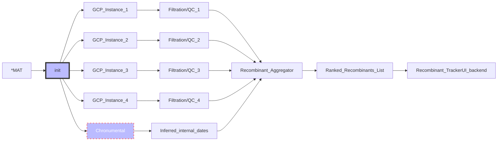

# SARS-CoV-2 Recombination Detection Workflow using RIPPLES

RIPPLES is a program to detect recombination events in large mutation annotated trees (MAT). This repo contains a workflow for running RIPPLES on Google Cloud Platform.

<br>

### Setup Google Cloud Platform Account and Service Account Keys
TODO: Add link to separate readme with instructions for this
___

## Recombinant Detection Workflow
Currently the entire recombination pipeline, with ranking, exists at the pre-built public docker image.

The Dockerfile also contains all the necessary installs to run the fill pipeline, and thus the entire workflow can be completed within a Docker shell and the results will be saved locally inside the shell and on remote GCP storage bucket at the specified location when the pipeline completes.


Launch the Docker shell with the following two commands.

- Put your service account key file in the corresponding location or update the location in the command below:
```
KEY=~/.config/gcloud/<key_file.json>
docker run -it -e GOOGLE_APPLICATION_CREDENTIALS=/tmp/keys/<key_file.json> -v ${KEY}:/tmp/keys/keys.json:ro mrkylesmith/ripples_pipeline_dev:latest
```

This will drop you into Docker shell where you can launch RIPPLES jobs on GCP.
```
cp template/ripples.yaml .
```
Add all RIPPLES runtime parameters and GCP machine configurations to your ripples.yaml file.
Set configurations for the current RIPPLES job you want to run in `ripples.yaml`, which you copied from `template` into the working directory of the Docker shell: `usher/scripts/recombination`
```
# GCP credentials
bucket_id: 
project_id: 
key_file: 

# GCP machine and Storage Bucket config
instances: 
boot_disk_size: 100
machine_type: e2-standard-16
logging: 

# Ripples parameters config [REQURIED]
version: ripples-fast
mat: 
newick:
metadata:
date: 
results: 
reference: reference.fa

# Ripples parameters
num_descendants: 5

```


To launch the RIPPLES job on GCP instances simply run the following command:
```
python3 run.py
```


### RIPPLES Workflow Diagram


*There are additional inputs to the pipeline along with the MAT, see description of inputs in `ripples.yaml` file above.

Above is a high level overview of the pipeline.  For more documentation on each step please see link below:
TODO: Add link to pipeline docs


### RIPPLES Pipeline Results
The pipeline will create a local results directory, based on the name given in `ripples.yaml`

<br>

## Generate additional data files needed for Recombination Tracker UI


You will need these two files, the final recombinant text file and generated VCF file to display visualizations.


## Visualize RIPPLES results with Recombination Tracker
Run the following command to create a local server and view Recombination Tracker in browser
```
python3 app.py -v <vcf_file.vcf> -r <final_recombinant_file.txt>
```

### Example:
To view an example of the Recombination Dashboard visulization there is example recombination data files in `example` directory.
Run the following command and past URL to browser to see the visualization.
```
python3 app.py -v example/example.vcf -r example/final_recombinant_example.txt>
```