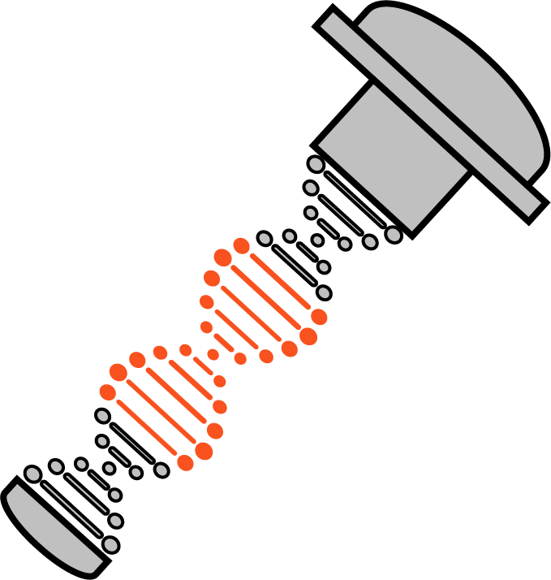
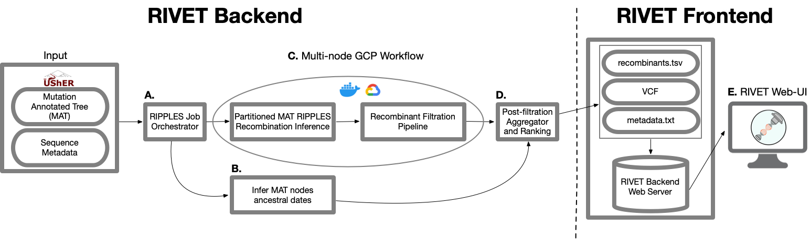

<!--img src="static/images/rivet-icon.png" width="300"-->

  

# RIVET
### SARS-CoV-2 RecombInation ViEwer and Tracker

[license-badge]: https://img.shields.io/badge/License-MIT-yellow.svg 
[license-link]: https://github.com/TurakhiaLab/rivet/blob/main/LICENSE
[![License][license-badge]][license-link]

 <a target="_blank" href="https://rivet.ucsd.edu/">View RIVET's Latest Detected Recombinants</a>

    RIVET is a software pipeline and visual web platform to perform SARS-CoV-2 recombination inference using <a target="_blank" href="https://www.nature.com/articles/s41586-022-05189-9">RIPPLES</a> and organize the relevant information in order to greatly accelerate the process of identifying and tracking SARS-CoV-2 recombinants.

  <h3>
    <a href="#overview">
      Overview
    </a>
     | 
    <a href="https://turakhialab.github.io/rivet/">
      Documentation
    </a>
     | 
    <a href="https://turakhialab.github.io/rivet/start/features.html">
      Getting Started
    </a>
  </h3>

## Table of Contents
- [Overview](#overview)
- [RIVET SARS-CoV-2 Web Interface](#web)
- [Use RIVET Locally](#local)
- [Citing RIVET](#cite_rivet)

##  Overview
 

RIVET is a program designed to aid in SARS-CoV-2 recombination analysis and consists of backend and frontend components:
1. [Backend](#rivet_backend): RIVET's backend pipeline uses [RIPPLES](https://www.nature.com/articles/s41586-022-05189-9) for recombination detection in a [mutation-annotated tree](https://usher-wiki.readthedocs.io/en/latest/UShER.html) and has a subsequent automated filtration pipeline to flag potential false-positives resulting from bioinformatic, contamination or other sequencing errors.  Next, the recombination results are ranked and additional results/metadata files are generated by the RIVET backend pipeline that can be loaded by the RIVET frontend.
2. [Frontend](#rivet_frontend): The RIVET frontend is an interactive, web-browser interface for online visualization, tracking, and analysis of recombination detection results.

We routinely run RIVET's backend pipeline on the latest [SARS-CoV-2 global MAT](https://hgdownload.soe.ucsc.edu/goldenPath/wuhCor1/UShER_SARS-CoV-2/) that is publicly shared by UCSC and make these results available for analysis and visualization at [https://rivet.ucsd.edu/]([https://rivet.ucsd.edu/).

 

##  RIVET SARS-CoV-2 Web Interface
To support ongoing SARS-CoV-2 recombinant lineage designation and genomic surveillance efforts, we provide a web interface ([https://rivet.ucsd.edu/](https://rivet.ucsd.edu/)) to summarize the results from running the `RIVET` backend on the latest SARS-CoV-2 mutation-annotated tree.  The `RIVET` web interface provides a suite of analysis and visualization tools to support rapid interpretation of detected recombinants, and provides integration with several tools such as `UShER`, `Taxonium` and `Nextstrain/Auspice`.

We currently plan to support weekly updates of the `RIVET` web interface and we hope to help support and accelerate the laborious process of SARS-CoV-2 recombinant lineage designation proposal.

 

**For more information on how to navagate the `RIVET` web interface, please see our documentation page here: [Web Interface Walkthrough](https://turakhialab.github.io/rivet/start/features)**

 

##  Use RIVET Locally
The `RIVET` backend and frontend components can also be installed and used locally to inferred infer putative recombinants in your sequences and visualize the results locally in your browser.

For more information on this workflow, please see our documentation page available here: [Use RIVET Locally](https://turakhialab.github.io/rivet/installation/installation)

 

##  Citing RIVET
Please cite the following papers if you found this website helpful in your research:

- Kyle Smith, Cheng Ye, Yatish Turakhia, "Tracking and curating putative SARS-CoV-2 recombinants with RIVET", bioRxiv (2023), https://doi.org/10.1101/2023.02.17.529036.

- Yatish Turakhia*, Bryan Thornlow*, Angie S. Hinrichs, Jakob McBroome, Nicolas Ayala, Cheng Ye, Kyle Smith, Nicola De Maio, David Haussler, Robert Lanfear, Russell Corbett-Detig, "Pandemic-Scale Phylogenomics Reveals The SARS-CoV-2 Recombination Landscape", Nature (2022), https://doi.org/10.1038/s41586-022-05189-9.
