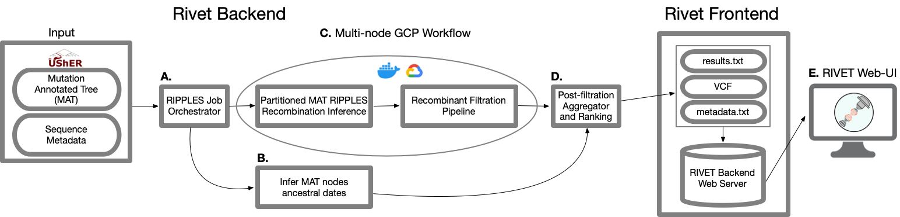
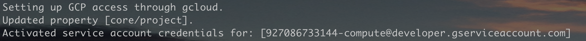

# RIVET: SARS-CoV-2 RecombInation ViEwer and Tracker

## Table of Contents
- [Overview](#overview)
- [Running RIVET Locally](#local_setup)
- [Example: Viewing your own recombinants with RIVET](#rivet_example)
- [RIVET Backend: SARS-CoV-2 Recombination Detection Pipeline using RIPPLES](#rivet_backend)
    - [Recombination Detection Workflow Setup](#rivet_backend_setup)
    - [RIVET Backend Pipeline Results](#rivet_backend_results)
- [Citing RIVET](#cite_rivet)


## <a name="overview"></a> Overview
<br>




RIVET is a program designed to aid in SARS-CoV-2 recombination analysis and consists of the following two main components:
1. A backend pipeline using RIPPLES (`ripples-fast`) for SARS-CoV-2 recombination detection over the global phylogeny and a subsequent automated GCP filtration pipeline of the putative recombinants, in order to filter out likely false-positives and sequencing errors.  Post-filration, the recombination results are ranked and additional results/metadata files are generated by the RIVET backend pipeline that are provided to and loaded by the RIVET frontend.
2. The RIVET frontend is an interactive, web-browser interface for online visualization, tracking, and analysis of recombination detection results.


## <a name="local_setup"></a> Running RIVET Locally 

### Activate Environment
Run the following commands to activate necessary Conda environment.
```
conda env create -f install/rivet_env.yml
conda activate rivet
```

Run the following command to serve RIVET locally in the browser.
```
python3 app.py -v <vcf_file.vcf> -r <final_recombinant_file.txt> -d <sample_descendants.tsv> -c <config_file.yaml
```
Type the following help command to see these options and their descriptions:
```
python3 app.py --help
```

## <a name="rivet_example"></a>Example: Viewing your own recombinants with RIVET
To view an example  there is example recombination data files in `example` directory.
Run the following command and past URL to browser to see the visualization.
```
python3 app.py -v example/trio_snps_10_22_22.vcf -r example/final_recombinants_10_20_22.txt -d example/samples_descendants_10_22_22.tsv
```


## <a name="rivet_backend"></a>SARS-CoV-2 Recombination Detection Pipeline using RIPPLES

RIPPLES is a program to detect recombination events in large mutation annotated trees (MAT). This repo contains a workflow for running RIPPLES on Google Cloud Platform.

<br>

### Setup Google Cloud Platform Account and Service Account Keys
Please see GCP setup docs here: [GCP Setup Docs](docs/gcp_setup.md)
___

## <a name="rivet_backend_setup"></a>Recombinant Detection Workflow Setup
Currently the entire recombination pipeline, with ranking, exists at the pre-built public docker image.

The Dockerfile also contains all the necessary installs to run the fill pipeline, and thus the entire workflow can be completed within a Docker shell and the results will be saved locally inside the shell and on remote GCP storage bucket at the specified location when the pipeline completes.


Launch the Docker shell with the following two commands.

- Put your service account key file in the corresponding location or update the location in the command below:
```
KEY=~/.config/gcloud/<key_file.json>
docker run -it -e GOOGLE_APPLICATION_CREDENTIALS=/tmp/keys/<key_file.json> -v ${KEY}:/tmp/keys/<key_file.json>:ro mrkylesmith/ripples_pipeline_dev:latest
```
**IMPORTANT NOTE:  I would recommend you keep the generated name of the `<keys.json>` file you downloaded, and make sure the naming of all the `<keys.json>` match in the two commands above, and in your `ripples.yaml` configuration file below, under the `key_file` field, that you will setup once you enter the Docker shell.**

This will drop you into Docker shell where you can launch RIPPLES jobs on GCP.
```
cp template/ripples.yaml .
```
Add all RIPPLES runtime parameters and GCP machine configurations to your ripples.yaml file.
Set configurations for the current RIPPLES job you want to run in `ripples.yaml`, which you already copied from `template` into the working directory of the Docker shell: `usher/scripts/recombination`
```
# GCP credentials
bucket_id: 
project_id: 
# Make sure key_file matches /tmp/keys/<key_file.json> 
key_file: 

# GCP machine and Storage Bucket config
instances: 
boot_disk_size: 100
# Keep machine type the same for now
machine_type: e2-standard-16

# Format job_name/logging (follow this format of top_folder_name/logging)  
# Format job_name/results (follow this format of top_folder_name/results)
# <job_name> can be anything that doens't exist in bucket already
logging: 
results: 

# Ripples parameters config [REQURIED]
version: ripples-fast
mat: 
# Naming for Newick tree that will be generated by pipeline
newick: gisaidAndPublic.$date.nwk
metadata:
# In format: 2022-08-14
date: 
reference: reference.fa

# Ripples parameters
num_descendants: 5

```

### Using Large Private MAT (Gisaid) vs Public MAT
The RIPPLES job should work the same from a user perspective whichever private or public MAT you use, however you should expect far less detected recombinants in the public MAT results and please see the note below about visualization.

**Note:** The following files with the same naming from the above config need to be placed in GCP Storage Bucket (`bucket_id`) ahead of time:
- `mat`
- `metadata`
- `raw sequence files:`
    - `gisaid_fullNames_$date.fa.xz`
    - `metadata_batch_$date.tsv.gz`
    - `ncbi.$date/cog_all.fasta.xz`
    - `cogUk.$date/genbank.fa.xz`

<br>

**Note: At this time, using a Gisaid MAT will NOT enable a Taxonium Tree view for the Recombinant Tracker visualization.  If you want to see recombinants on Taxonium tree, use a public MAT.**

To launch the RIPPLES job on GCP instances simply run the following command:
```
python3 run.py
```

If you have filled out all fields in the `ripples.yaml` configuration file and also if your Service Account credentials have been setup correctly, `GOOGLE_APPLICATION_CREDENTIALS` environment variable and `<key_file.json>` are passed correctly through volume into Docker container, then you should see the following message at the command line after running `python3 run.py`



## <a name="rivet_backend_results"></a>RIVET Backend Pipeline Results
The pipeline will create a local results directory, based on the name given in `ripples.yaml`

The pipeline will automatically output the following four files:

- `trios.vcf`: VCF file containing the SNVs of each trio (recombinant and its parents) nodes.
- `final_recombinants.txt`: a txt file containing the detected recombinants, with the recombinant node id, donor node id and acceptor node id required as the first three columns in the file. The rest of the columns contain information about each detected recombinant, including clade/lineage assignments, 3SEQ p-values, a representative descedanat, ranking scores, and other information to be displayed by the RIVET interface.
- `descedants.txt`: a TSV file containing a mapping from each trio node, to a set of descedants for that node
- `<tree_data>.taxonium.jsonl.gz`: a jsonl file used by RIVET interface to display recombinant node trios within the context of the global phylogeny, powered by Taxonium and Treenome.


## <a name="cite_rivet"></a> Citing RIVET
