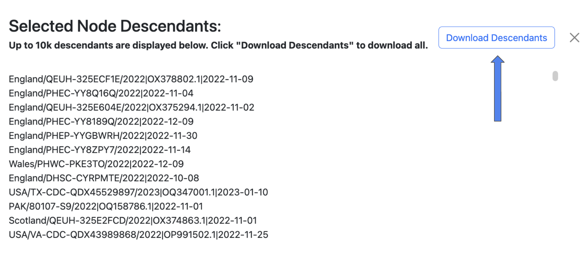
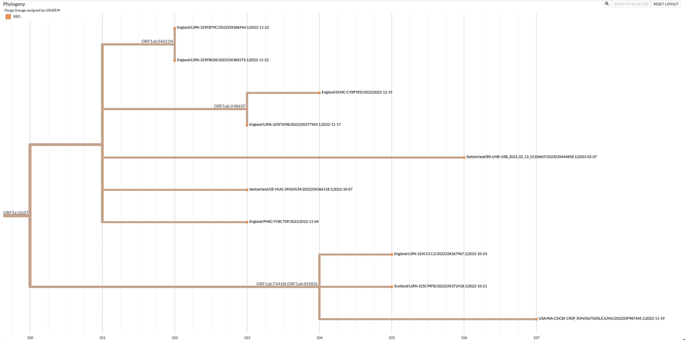
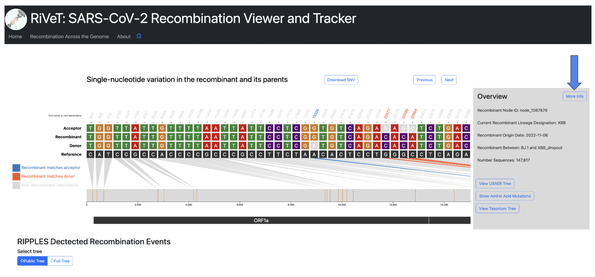
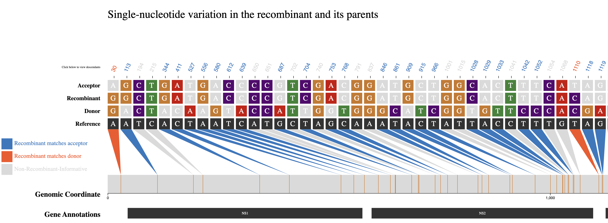

# Welcome to the RIVET Wiki

RIVET is a software pipeline and visual web platform to perform SARS-CoV-2 recombination inference using RIPPLES and organize the relevant information in order to greatly accelerate the process of identifying and tracking SARS-CoV-2 recombinants.

<br>
<hr>

## RIVET Video Tutorial
<iframe width="1000" height="600"  src="https://youtube.com/embed/XelRL3qJlD0" frameborder="0" allowfullscreen></iframe>

<br>
<hr>

## RIVET Architecture

RIVET is a program designed to aid in SARS-CoV-2 recombination analysis and consists of backend and frontend components:

<br>
1. [Backend](installation/upload.md): RIVET's backend pipeline uses [RIPPLES](https://www.nature.com/articles/s41586-022-05189-9) for recombination detection in a [mutation-annotated tree](https://usher-wiki.readthedocs.io/en/latest/UShER.html) and has a subsequent automated filtration pipeline to flag potential false-positives resulting from bioinformatic, contamination or other sequencing errors.  Next, the recombination results are ranked and additional results/metadata files are generated by the RIVET backend pipeline that can be loaded by the RIVET frontend.

<br>
2. [Frontend](installation/analyze.md): The RIVET frontend is an interactive, web-browser interface for online visualization, tracking, and analysis of recombination detection results.
<br>


<br>
<hr>

## Web Interface Walkthrough

<br>

### Selecting Recombinant of Interest
Each row in the results table represents an inferred recombinant. You can **horizontally scroll** to the right to view more columns in the table, and **click** a row to select the recombinant you are interested in visualizing. 


For detailed information on each column of the results table, please see the [RIVET Results Table](start/table.md) page.

### Results Table Next and Previous Buttons
Use the `next` and `previous` buttons shown below to skip to the next recombinant result (next row) and SNV visualization in the table.


!!! tip
    You can also use the arrow keys instead of the `next` and `previous` buttons.  Use the right arrow key :arrow_forward: and left arrow key :arrow_backward: to skip to `next` and `previous` results respectively.


### Sort by Column
The results can be sorted by any column, by **clicking on the column title**, shown below:

<br>

!!! note
    By default, the results are ranked by the `Recombinant Ranking Score`.


### Search Table
The table can be searched and the results shown will be filtered down based on the given query.  For example, if you want to search for all recombinant results with `XBB` lineage classification just type `XBB` into the search bar.

### Search by Sample ID
A user can search for recombinant ancestry in specific samples by using the search by sample identifer feature. Click the toggle button to its active state, and then enter the sample identifier into the search bar.  When the `Search by sample` toggle is active, normal table search will be disabled and all search queries should be sample identifiers.

!!! note
    Once you have entered the sample identifier into the search bar, it may take a few seconds for the table results to refresh with the results of your query.


### SNV plot
When a user clicks on a row to select a recombinant of interest the following visualization, shown below, will be rendered.


The above visualization shows all of the single-nucleotide variant (SNV) sites in the recombinant sequence and its two parents (donor/acceptor), with respect to the reference sequence. The recombinant-informative sites are highlighted in <span style="color:orange">orange</span> where the recombinant matches the donor, and <span style="color:DodgerBlue">blue</span> where the recombinant matches the acceptor.  The gene region annotations are shown below the trio sequences in the bottom track.


### Query Descendants
For a selected recombinant ancestor node of interest, you might want to query which samples are descendants of this inferred recombinant. Simply **click** the `Recombinant` label to the left of the track to view up to 10,000 sample descendants of that particular recombinant, as seen in the screenshots below.

You can also click the `Donor` and `Acceptor` labels to query the samples that are descendants of those particular parental nodes.


<br>

The side panel will display the 10,000 sample descendants by default, and you can **click** the `Download Descendants` button to download a `.txt` file containing all sample descendants for the selected trio node. (one per line)



<br>

### Taxonium View
View trio sequences (recombinant/donor/acceptor) in Taxonium/Treenome Global Phylogeny.
!!! note

    The Taxonium view feature is currently only available for public tree results.
<br>


<br>

The `Recombinant/Donor/Acceptor` nodes are circled in the global tree. Click the magnify button shown in the image below to zoom into the particular node of interest.


<br>

### View UShER Subtree
This feature will take you to the [UCSC UShER](https://genome.ucsc.edu/cgi-bin/hgPhyloPlace) tool, where you can view the tree using [UShER](https://github.com/yatisht/usher). This feature will automatically sample 10 descendants from the recombinant node in order to view the subtree.


!!! warning

    This feature will open a new tab to `UShER` and may take a few minutes to load in the new tab.

Once finished loading, you will see the following page, where you can view the subtree by clicking `view downsampled global tree in Nextstrain`.<br>


<br>



<br>

### Recombinant Detailed Overview
To view more even more detailed information about a particular recombinant of interest click the `More Info` button in the `Overview` section.


<br>

**This will display the following information:**

* Current Recombinant Lineage
* Recombinant Origin Date (as inferred by [Chronumental](https://doi.org/10.1101/2021.10.27.465994))
* Recombinant parental lineages
* Number of sequences descendant from this recombinant
* Earliest descendant sequence
* Most recent descendant sequence
* Countries where descendant sequences have been detected
* Quality Control Checks not passing (otherwise <span style="color:green">PASS</span> if all QC checks pass)


!!! question

    If there is additional information you would like to know for a particular recombinant of interest, please make this suggestion through a [GitHub Issue](https://github.com/TurakhiaLab/rivet/issues) in our repository.

<br>

### View Amino Acid Sites
This option shows the amino acid mutations matched with their corresponding nucleotide mutation positions. This feature uses `matUtils summary --translate`, which is built automatically into the `RIVET` backend pipeline. In short, `matUtils` provides a method to compute the correct amino acid translations at each node in the tree, which `RIVET` uses to obtain the amino acid mutations for a given recombinant ancestor node.

For more information on this method, please see the following [matUtils documentation](https://usher-wiki.readthedocs.io/en/latest/tutorials.html#example-amino-acid-translation-workflow).


<br>
All coding amino acid translations are annotated above each corresponding SNV position (if any).


<br>
<hr>

## RIVET Results Table
Each of the sections below describes the columns of RIVET's results table of inferred recombinant ancestors.

**Recombinant Node ID**<br>

* UShER assigned node id for inferred recombinant node

**Donor Node ID** <br>

* UShER assigned node id for donor (recombinant parentental node)

**Acceptor Node ID**<br>

* UShER assigned node id for acceptor (recombinant parentental node)

**Breakpoint 1 Interval** <br>

* RIPPLES inferred breakpoint interval 1

**Breakpoint 2 Interval**<br>

* RIPPLES inferred breakpoint interval 2

!!! info

    For more information on the `RIPPLES` algorithm, please see: [Pandemic-scale phylogenomics reveals the SARS-CoV-2 recombination landscape](https://www.nature.com/articles/s41586-022-05189-9)


**Recombinant Clade**<br>

* Recombinant clade classification as assigned by `Nextstrain`

**Recombinant Lineage**<br>

* Recombinant lineage designation as assigned by `Pangolin`

**Donor Clade**<br>

* Donor clade classification as assigned by `Nextstrain`

**Donor Lineage**<br>

* Donor lineage designation as assigned by `Pangolin`

**Acceptor Clade**<br>

* Acceptor clade classification as assigned by `Nextstrain`

**Acceptor Lineage**<br>

* Acceptor lineage designation as assigned by `Pangolin`

**Chronumental-inferred origin date**<br>

* Inferred first emergence of recombinant ancestor sequence using the [Chronumental](https://github.com/theosanderson/chronumental) method, which runs automatically as part of the `RIVET` pipeline. In short, `Chronumental` is a accurate and scalable time-tree estimation method that uses stochastic gradient descent to estimate lengths of time for tree branches under a probabilistic model. For more information on this method, please see the [Chronumental](https://doi.org/10.1101/2021.10.27.465994) paper.

**Recombinant Ranking Score**<br>

* The ranking score represents a **growth score** that we compute for each inferred recombinant, which is designed to help prioritize recently emerging recombinants and recombinants with many descendant circulating sequences.
* By default, we order the main `RIVET` results table by maximum ranking score, which attempts to prioritize highest concern recombinants of interest at the top of the list.<br>

    The recombinant **growth metric** below, *G(R)*, for a recombinant node with a set of descendants *S* is defined below:

$$ \ G(R) = 2^{-m(R)} * \sum_{s\in S} 2^{-m(s)} $$

* In the equation above, and correspond to the number of months (30-day intervals) *𝑚(𝑅)* *𝑚(𝑠)*
elapsed since the recombinant node was inferred to have originated and its descendant *𝑅*
sequence was sampled, respectively. The growth score above, *G(R)*, is computed for each
detected recombinant *R*, and the final recombinant list is ranked based on descending growth
scores.

**Representative Descendant**<br>

* This selected sample is a descendant with the fewest additional mutations as compared to it's recombinant ancestor.


**Informative Site Sequence**<br>

* The informative site sequence is a binary string of `A` and `B` for each trio sequence, where an `A` is assigned if the recombinant node allele at the site matches only the donor node allele at that site, or a `B` if the recombinant matched only the acceptor.


**3SEQ (M, N, K)**<br>

* 3SEQ M, M, K values used to check individual p-values in a pre-generated 3SEQ p-value table.


**3SEQ P-Value**<br>

!!! info
    For more information on the `3SEQ` method and its use in `RIPPLES`, please see [Improved Algorithmic Complexity for the 3SEQ Recombination Detection Algorithm](https://academic.oup.com/mbe/article/35/1/247/4318635) and the Supplementary Section of [Pandemic-scale phylogenomics reveals the SARS-CoV-2 recombination landscape](https://www.nature.com/articles/s41586-022-05189-9#MOESM1)


**Original Parsimony Score**<br>

* The original parsimony placement score on the global phylogeny.

**Parsimony Score Improvement**<br>

* Highest parsimony score improvement relative to original parsimony score.


**Quality Control (QC) Flags**<br>

* This column represents quality control (QC) or filtration checks that where flagged, meaning that this inferred recombinant is not high-confidence and could represent a false-positive recombinant resulting from bioinformatic, contamination or other sequencing errors. 


!!! info

    For detailed description of each quality control and filtration check performed in `RIVET's` backend pipeline, see the [Quality Control and Filtration Checks](start/filtration.md) page.

**Common sources of <span style="color:red">false positive</span> errors in `RIVET’s` pipeline include, but are not limited to:**

* Contamination, sequencing, or assembly errors in the recombinant or parent sequences
* Missing sequences resulting in artificially long branches in the UCSC public tree
* Misalignments or phylogenetic inconsistencies


**Common sources of <span style="color:red">false negative</span> errors in `RIVET’s` pipeline include, but are not limited to:**

* Too few recombination-informative sites in the recombinant
* More than two breakpoints are required to explain the recombinant
* Too few descendants of the recombinant or its parent in the UCSC public tree


**"Click to View" Taxonium**<br>

* When clicked, this button will open a separate tab launching the [Taxonium](https://taxonium.org/) browser in order to view the particular recombinant trio (recombinant/donor/acceptor) in the context of the global phylogeny.
In short, [Taxonium](https://elifesciences.org/articles/82392) is a visualization tool for exploring large trees.

<br>
<hr>

## Quality Control and Filtration Checks
<br>

**3SeqP02**<br>

* P-value from 3-seq > 0.2.

**russPval005**<br>

* False-discovery rate (FDR) of the parsimony improvement > 0.05. (See [Supplementary Text S3 of RIPPLES](https://www.nature.com/articles/s41586-022-05189-9#MOESM1) for details of the null model.)

**Alt**<br>

* "Alternate": Other recombination trios with the same recombination node have more parsimony improvement, fewer possible breakpoint intervals, or better P-values.

**cluster**<br>

* All recombination informative mutations occur within a span of 20 nucleotides.

**redundant**<br>

* More than two of the recombination node, donor node, and acceptor node appear in that of another trios.

**Informative_sites_clump**<br>

* More than 5 recombination-informative mutations in a 20-nucleotide span.

**Suspicious_mutation_clump**<br>

* More than 6 mutations (or 3 near indels) in a 20-nucleotide span on any of the donor node, the aceptor node or the recombination node.

**Too_many_mutations_near_INDELs**<br>

* Too many mutations on 100-nt spans near indels or a string of Ns.

<br>
<hr>

## Using RIVET for Other Pathogens
<br>

Below are two examples of using `RIVET's` backend pipeline to infer and visualize recombinants of other pathogens beyond SARS-CoV-2.

!!! warning
    Currently, `RIVET's` backend QC/filtration pipeline is specific to SARS-CoV-2 and will not run when using the `RIVET` backend for other pathogens.


### Human Respiratory Syncytial Virus (HRSV) Subgroup A

Below is the SNV visualization resulting from inferring a putative recombinant in an `RSV` mutation-annotated tree (MAT).




Since the SNV plot for RSV includes many sites, only the region up to around position 1000 is shown in the image above.  
**Please click the download button below to view the entire `RSV` SNV plot as an SVG image.**

<div>
<a href="start/images/rsv-snv.svg" download>
  <button class="btn" type="button">Download Full RSV SNV Plot</button>
</a>
</div>

<style>
/* Style for download button */
.btn {
  background-color: DodgerBlue;
  border: none;
  color: white;
  padding: 12px 30px;
  cursor: pointer;
  font-size: 20px;
}

.btn:hover {
  background-color: RoyalBlue;
}
</style>

<hr>


### Monkeypox Virus

Edit the following fields in the `config.yaml` file:

Change the GenBank file from the default SARS-CoV-2 file to the corresponding GenBank file for your pathogen of interest, Monkeypox virus in this case.

```yaml
# Pathogen Ref Seq GenBank file
ref_seq: monkeypox.gb
```

!!! Warning
    Make sure the `environment` field is set to `local`.

```yaml
environment: local
port: 2000
```
If desired, you can change the local `port` at which `RIVET` will host the local HTTP server in your browser.

<br>

Now run the following command and RIVET will automatically open your browser to launch the frontend results table and SNV visualization.
```
python3 rivet-frontend.py -r recombination_mpxv.2023-07-01.tsv -v mpxv.2023-07-01.vcf -c config.yaml
```

Below is the SNV plot we get for one of the monkeypox virus inferred recombinants.


<br>

!!! check
    For pathogens with larger genomes than SARS-CoV-2, you may want to change the step interval of genomic coordinate tick marks.  This can be done by changing the `tick_step` field in `RIVET` frontend `config.yaml` file.

<br>
<hr>

## Use RIVET Locally


### Installing RIVET Backend using Docker on Linux
!!! Install
    Install `Docker` on your machine first.

For ease of use, the entire `RIVET` backend pipeline, including recombinant ranking, is contained within a pre-built public docker image.

### Running RIVET Backend Locally On Your Machine
A `RIVET` backend job can be run locally on your machine.
To launch a Docker shell, run the following two commands.
```
docker run -it mrkylesmith/ripples_pipeline:latest
```
This will run an interactive `Docker` shell with the necessary `RIVET` environment.

<br>

Type the following help command to ensure your `RIVET` backend environment is configured correctly.

```
python3 rivet-backend.py --help
```

The `wget` command-line utility for downloading files from the internet (the necessary `MAT`, metadata and sequence files required as input to `RIVET`) is included in the `Docker` environment. Proceed to the next steps for running a `RIVET` backend job: [Inferring Recombinants Using the RIVET Backend](installation/upload.md).

<hr>
<br>

### Running RIVET Backend On Google Cloud
We also provide the build-in option of running a parallelized `RIVET` job across a user specified number of Google Cloud Platform (GCP) machines.

!!! setup
    If you would like to use GCP, please see the following docs for setting up an account with Google Cloud Platform: [GCP Setup Docs](gcp_setup.md)

!!! important
    Put your GCP service account key file (obtained following the docs linked above) in the corresponding location as the command below or update the location in the command below:

To launch a Docker shell using GCP, run the following two commands providing your GCP Authentication keys file.

```
KEY=~/.config/gcloud/<key_file.json>
docker run -it -e GOOGLE_APPLICATION_CREDENTIALS=/tmp/keys/<key_file.json> -v ${KEY}:/tmp/keys/<key_file.json>:ro mrkylesmith/ripples_pipeline:latest
```

<hr>
<br>

### Install RIVET Frontend Locally On Your Machine 

### Clone RIVET Repo Locally
```
git clone https://github.com/TurakhiaLab/rivet.git
cd rivet
```

### Conda Install
!!! Install
    Install `Conda` on your machine first.

All the `RIVET` frontend dependencies have been added to Conda environment setup, that can be found in the `install` directory.

<br>

Run the following commands to activate the `rivet` Conda environment.
```
conda env create -f install/rivet_env.yml
conda activate rivet
```
<br>

Type the following command to ensure your `RIVET` frontend environment is configured correctly, and then proceed to the next steps for using the `RIVET` frontend: [Visualizing Your Results Using the RIVET Frontend](installation/analyze.md)

```
python3 rivet-frontend.py --help
```

<br>
<hr>

## Inferring Recombinants Using the RIVET Backend

Infer recombinant ancestry in your own SARS-CoV-2 sequences using `RIVET's` backend.

!!! Installation
    Make sure `RIVET` is installed on your local machine before proceeding.

<hr>

### <a name="rivet_backend"></a>RIVET Backend

The `RIVET` backend uses [RIPPLES](https://www.nature.com/articles/s41586-022-05189-9) for SARS-CoV-2 recombination detection. For more information on the `RIPPLES` algorithm please see: [Pandemic-Scale Phylogenomics Reveals The SARS-CoV-2 Recombination Landscape](https://doi.org/10.1038/s41586-022-05189-9)


### RIVET Backend Architecture
A. **RIPPLES Job Orchestrator**
When running a `RIVET` job on Google Cloud Platform (GCP), `RIVET` calculates the number of long branches in the input mutation-annotated tree and partitions them across `n` GCP instances, which is a parameter specified by the user.  This stage of the pipeline is responsible for setting up and launching these parallel jobs, as well as monitoring their progress as they run. This stage of the pipeline also initiates a [Chronumental](https://github.com/theosanderson/chronumental) job, to run concurrently as a subprocess on the local machine, which is explained in the following part B.


B. **Infer MAT nodes ancestral dates**
In order to infer the emergence of detected ancestral recombinant nodes of interest for ranking and epidemiological prioritization, `RIVET` builds a time-tree using the [Chronumental](https://www.biorxiv.org/content/10.1101/2021.10.27.465994v1) method. This method uses the sample dates provided in the sequence metadata file to build a probabilistic
model for length of time across branches in the tree and is able to infer the dates of all internal nodes in the tree. `RIVET` uses these dates for internal nodes that we label as recombinants.

C. **Mult-node GCP Workflow**
When running a `RIVET` job on GCP, the `RIPPLES` recombinant search and subsequent filtration pipeline utilizes multi-node parallelism. The degree of speedup depends on how many GCP instances the user decides to allocate towards the job, since the `MAT` long branches to search will be automatically partitioned across the given `n` machines. On each instance, once a putative list of recombinant nodes is obtained, the pipeline on that machine begins quality control and filtration checks to flag false-positive recombinants. 

D. **Post-filtration Aggegrator and Ranking**
This is the last stage of the pipeline and it occurs on your local machine, for both on-premise and GCP `RIVET` workflows. Once the recombination search and filtration steps of the pipeline have concluded on **all** instances and the local `Chronumental` job has finished, the filtered recombinant results for each partition of long branches are aggregated locally and the post-filtration stage of the pipeline can begin. During this last step, the final list of recombinants is ranked according to a [growth metric](start/table.md#recombinant-ranking-score) and also additional information on each recombinant is gathered, such as clade/lineage information, descendant samples, parsimony scores, quality control/filtration information, and more.  For a full list of all information reported about each putative recombinant, please see our documentation about the [RIVET Results Table](start/table.md)


### RIVET Backend Input

!!! warning
    All input files should be placed in the current directory where you will launch your `RIVET` workflow.

    **If using GCP:** The following input files with the same naming as you specify in the `config.yaml` file below need to be placed in your GCP Storage Bucket (`bucket_id`) before launching the remote `RIVET` job.

1. `UShER Mutation-Annotated Tree (MAT)`: Updated daily and can be obtained here: [SARS-CoV-2 global MAT](https://hgdownload.soe.ucsc.edu/goldenPath/wuhCor1/UShER_SARS-CoV-2/)
    - `RIVET` performs recombination search using `RIPPLES` over an UShER mutation-annotated tree (`MAT`).  Any samples you wish to search for recombinant ancestry must first be added to the `MAT` using [UShER](https://github.com/yatisht/usher/tree/master). 
    <br>

2. `Sequence Metadata`: Also updated daily to match the sequences in the corresponding MAT and can be obtained here: [metadata](https://hgdownload.soe.ucsc.edu/goldenPath/wuhCor1/UShER_SARS-CoV-2/)
    - The sequence metadata is a `TSV` file containing information about each sample in the `MAT`, including its name, date sequenced, country sequenced, and clade/lineage information. This information is used throughout the `RIVET` backend pipeline, for inferring the recombinant ancestor emergence date for example.
<br>
3. `Sequence Files (FASTA):` Downloadable at the following links, for a given `$TREE_DATE` (eg. 2022-07-04)
    * `https://hgwdev.gi.ucsc.edu/~angie/sarscov2phylo/ncbi.$TREE_DATE/genbank.fa.xz`
    * `https://hgwdev.gi.ucsc.edu/~angie/sarscov2phylo/cogUk.$TREE_DATE/cog_all.fasta.xz`
    <br>

!!! info
    During the `RIVET` backend quality control and filtration pipeline these sample sequence files are aligned to the SARS-CoV-2 reference and the `RIPPLES` inferred recombinantion-informative sites are inspected for bioinformatic and sequencing error quality issues to flag false-positive recombinants. 

!!! example
    To download the SARS-CoV-2 `Genbank` sequences for `2022-07-04`:
    ```
    wget https://hgwdev.gi.ucsc.edu/~angie/sarscov2phylo/ncbi.2022-07-04/genbank.fa.xz
    ```


### Launch RIVET Job


The `RIVET` backend is setup to be run **locally on your own machine** or on **Google Cloud Platform (GCP)**, and for ease-of-use is entirely configured through the use of the `config.yaml` file.

!!! Setup
    If you would like to run your RIVET backend job on Google Cloud Platform, please see the following documentation for setting up an account: [GCP Setup Docs](gcp_setup.md)

Copy the config file from `template/config.yaml` into the current directory and fill out the fields.  More information on each field can be found below.
```
cp template/config.yaml .
```

```yaml
# GCP Credentials [LEAVE EMPTY FOR LOCAL JOB]
bucket_id:
project_id:
key_file: /tmp/keys/

# GCP Machine and Storage Bucket Config [LEAVE EMPTY FOR LOCAL JOB]
instances:
boot_disk_size: 50
machine_type:

# Ripples Parameters Config [REQUIRED]
version: ripples-fast
mat:
newick:
metadata:
date:
# Local results output directory, or name of folder on GCP storage bucket
results:
reference: reference.fa

# Additional Parameters
num_descendants: 5
public_tree: True
verbose: False
# Default to all available threads if left empty
threads:
docker_image: mrkylesmith/ripples_pipeline:latest
generate_taxonium: False
```

Fill out the configuration file with the settings for your `RIVET` job.  If the field is already filled in, you will likely not want to change that parameter value.

!!! info Configuration File
    For more information on each field in the `config.yaml` file please see the following page: [RIVET Backend Configuration](installation/config.md)


### RIVET Backend Outputs

The pipeline will create a local results directory, based on the name given for the `results` field in `config.yaml`

The pipeline will automatically output the following four files within your local `results` directory (and in `GCP` bucket if running remote job):

1. `final_recombinants_<DATE>.txt`: a `TSV` file containing the detected recombinants, with the recombinant node id, donor node id and acceptor node id as the first three columns in the file. The rest of the columns contain information about each detected recombinant, including clade/lineage assignments, 3SEQ M,N,K and p-values, a representative descendant (containing the fewest additional mutations with respect to the recombinant node), recombinant ranking scores, and other information to be displayed by the RIVET frontend. For more information on this file, please see the [RIVET Results Table](start/table.md) page.

<br>

2. `trios.vcf`: VCF file containing the SNVs of each trio (recombinant and its parents) node.

<br>

3. `sample_descedants.txt.xz`: a `TSV` file where each row contains a mapping from each trio node id (one node id per row), to a set of descendant samples corresponding to that internal node id.

<br>

4. `<DATE>.taxonium.jsonl.gz`: a jsonl file used by RIVET frontend to display the recombinant node trios within the context of the global phylogeny, powered by Taxonium and Treenome.

<br>

!!! note
    Currently the `Taxonium` view is only provided using public trees provided at: [https://hgdownload.soe.ucsc.edu/goldenPath/wuhCor1/UShER_SARS-CoV-2/](https://hgdownload.soe.ucsc.edu/goldenPath/wuhCor1/UShER_SARS-CoV-2/)

<br>
<hr>

## Visualizing Your Results Using the RIVET Frontend
<br>

!!! install
    Make sure you have installed the `RIVET` frontend on your machine before proceeding.

!!! note
    If you are using the `RIVET` frontend to visualize recombinants for pathogens other than SARS-CoV-2, please see the **Using RIVET for Other Pathogens** page.

### Configuration

`RIVET's` frontend settings can be configured using the provided YAML file, `config.yaml`. 

```yaml
# Configuration file for RIVET
### Color Schema Options ####
# Base coloring
a: '#cc0000'
g: '#cc7722'
c: '#57026f'
t: '#338333'
base_matching_reference: '#dadada'
reference_track: '#333333'

# Recombinant-Informative Coloring for polygons/position column labels
recomb_match_acceptor: '#2879C0'
recomb_match_donor: '#F9521E'
non_informative_site: '#dadada'

# Breakpoint Intervals
breakpoint_intervals: '#800000'

# Genomic Coordinate Track (default all genomic regions are same color)
genomic_regions: '#33333'
# Step for tick-marks on genomic coordinate track
tick_step: 1000

# Pathogen
ref_seq: NC_045512.gb

### Taxonium Tree View Options ###
date: 2023-01-31
bucket_name: public_trees

# Keep environment as "local"
environment: local
# If running locally, port to use
port: 2000
```

!!! warning
    When running `RIVET` locally, don't change the `environment` field.  Also, it won't be necessary to change the `date` field or `bucket_name` field.


Run the following command to launch the `RIVET` frontend in your local browser.

!!! example
    Try the following example using example SARS-CoV-2 recombinants provided in the `example/` directory.

```python
python3 rivet-frontend.py -r example/final_recombinants_example.txt -v example/trios_example.vcf -c config.yaml
```
<br>

### Required Inputs
`-f, RECOMBINANT_RESULTS`: Input text file containing inferred recombinant nodes.  First three columns in this text file must contain (1) recombinant node ID\t (2) donor node ID\t (3) acceptor node ID.  Note, donor and acceptor denote the two parental nodes of the inferred recombinant.

**Expected format:**

| Recombinant Node ID       | Donor Node ID | Acceptor Node ID |
| ------------------------- | -----------   | ---------------- |
| node_1156861              | node_1155169  | node_1167556     |
| node_1067629              | node_1021823  | node_1156861     |

Additional columns can be provided optionally and will be included in the rendered results table, but are **not required**.


!!! note
    The `RIVET` backend will automatically generate the necessary input files above.  Follow the steps listed on the [Inferring Recombinants Using the RIVET Backend](installation/upload.md) page.  However, the `RIVET` frontend can also be used independently of the backend, just ensure that the input files adhere to the expected formatting.

<br>

`-v, VCF`: An input VCF containing single-nucleotide variants (SNVs) of all recombinant/donor/acceptor trio nodes present in the input `RECOMBINANT_RESULTS` file.

!!! note 
    RIVET only supports viewing single-nucleotide variants (SNVs), and not indels or SVs. Please see the following workflow to [create a VCF](create_vcf.md) for uploading to RIVET locally.

<br>

`-c, CONFIG`: The `config.yaml` file, shown at the top of this page, and provided in the repository.
