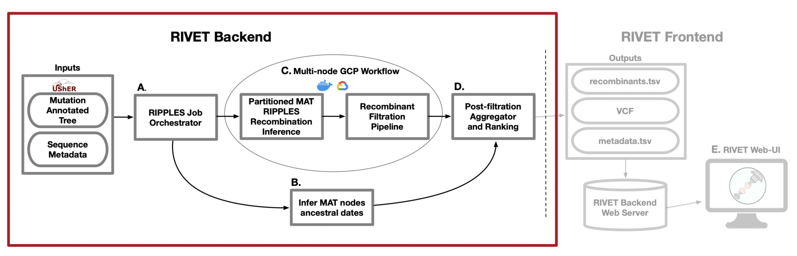

# Uploading Your Sequences
Upload your own SARS-CoV-2 sequences and infer recombinant ancestry using `RIVET's` backend.

!!! Installation
    Make sure `RIVET` is installed on your local machine before proceeding, otherwise install `RIVET` first by following these steps: [Install RIVET On Your Machine](installation.md)

<hr>

## <a name="rivet_backend"></a>RIVET Backend

The `RIVET` backend uses [RIPPLES](https://www.nature.com/articles/s41586-022-05189-9) for SARS-CoV-2 recombination detection. For more information on the `RIPPLES` algorithm please see: [Pandemic-Scale Phylogenomics Reveals The SARS-CoV-2 Recombination Landscape](https://doi.org/10.1038/s41586-022-05189-9)



### RIVET Architecture
A. **RIPPLES Job Orchestrator**
When running a `RIVET` job on Google Cloud Platform (GCP), `RIVET` calculates the number of long branches in the input mutation-annotated tree and partitions them across `n` GCP instances, which is a parameter specified by the user.  This stage of the pipeline is responsible for setting up and launching these parallel jobs, as well as monitoring their progress as they run. This stage of the pipeline also initiates a [Chronumental](https://github.com/theosanderson/chronumental) job, to run concurrently as a subprocess on the local machine, which is explained in the following part B.


B. **Infer MAT nodes ancestral dates**
In order to infer the emergence of detected ancestral recombinant nodes of interest for ranking and epidemiological prioritization, `RIVET` builds a time-tree using the [Chronumental](https://www.biorxiv.org/content/10.1101/2021.10.27.465994v1) method. This method uses the sample dates provided in the sequence metadata file to build a probabilistic
model for length of time across branches in the tree and is able to infer the dates of all internal nodes in the tree. `RIVET` uses these dates for internal nodes that we label as recombinants.

C. Mult-node GCP Workflow
When running a `RIVET` job on GCP, the `RIPPLES` recombinant search and subsequent filtration pipeline utilizes multi-node parallelism. The degree of speedup depends on how many GCP instances the user decides to allocate towards the job, since the `MAT` long branches to search will be automatically partitioned across the given `n` machines. On each instance, once a putative list of recombinant nodes is obtained, the pipeline on that machine begins quality control and filtration checks to flag false-positive recombinants. 

D. Post-filtration Aggegrator and Ranking
This is the last stage of the pipeline and it occurs on your local machine, for both on-premise and GCP `RIVET` workflows. Once the recombination search and filtration steps of the pipeline have concluded on **all** instances and the local `Chronumental` job has finished, the filtered recombinant results for each partition of long branches are aggregated locally and the post-filtration stage of the pipeline can begin. During this last step, the final list of recombinants is ranked according to a [growth metric](https://turakhialab.github.io/rivet/start/table.html#recombinant-ranking-score) and also additional information on each recombinant is gathered, such as clade/lineage information, descendant samples, parsimony scores, quality control/filtration information, and more.  For a full list of all information reported about each putative recombinant, please see our documentation about the [RIVET Results Table](https://turakhialab.github.io/rivet/start/table.html).


## RIVET Backend Input

!!! warning
    All input files should be placed in the current directory where you will launch your `RIVET` workflow.

    **If using GCP:** The following input files with the same naming as you specify in the `config.yaml` file below need to be placed in your GCP Storage Bucket (`bucket_id`) before launching the remote `RIVET` job.

1. `UShER Mutation-Annotated Tree (MAT)`: Updated daily and can be obtained here: [SARS-CoV-2 global MAT](https://hgdownload.soe.ucsc.edu/goldenPath/wuhCor1/UShER_SARS-CoV-2/)
    - `RIVET` performs recombination search using `RIPPLES` over an UShER mutation-annotated tree (`MAT`).  Any samples you wish to search for recombinant ancestry must first be added to the `MAT` using [UShER](https://github.com/yatisht/usher/tree/master). 
    <br>

2. `Sequence Metadata`: Also updated daily to match the sequences in the corresponding MAT and can be obtained here: [metadata](https://hgdownload.soe.ucsc.edu/goldenPath/wuhCor1/UShER_SARS-CoV-2/)
    - The sequence metadata is a `TSV` file containing information about each sample in the `MAT`, including its name, date sequenced, country sequenced, and clade/lineage information. This information is used throughout the `RIVET` backend pipeline, for inferring the recombinant ancestor emergence date for example.
<br>
3. `Sequence Files (FASTA):` Downloadable at the following links, for a given `$TREE_DATE` (eg. 2022-07-04)
    * `https://hgwdev.gi.ucsc.edu/~angie/sarscov2phylo/ncbi.$TREE_DATE/genbank.fa.xz`
    * `https://hgwdev.gi.ucsc.edu/~angie/sarscov2phylo/cogUk.$TREE_DATE/cog_all.fasta.xz`
    <br>

!!! info
    During the `RIVET` backend quality control and filtration pipeline these sample sequence files are aligned to the SARS-CoV-2 reference and the `RIPPLES` inferred recombinantion-informative sites are inspected for bioinformatic and sequencing error quality issues to flag false-positive recombinants. 

!!! example
    To download the SARS-CoV-2 `Genbank` sequences for `2022-07-04`:
    ```
    wget https://hgwdev.gi.ucsc.edu/~angie/sarscov2phylo/ncbi.2022-07-04/genbank.fa.xz
    ```


## Launch RIVET Job


The `RIVET` backend is setup to be run **locally on your own machine** or on **Google Cloud Platform (GCP)**, and for ease-of-use is entirely configured through the use of the `config.yaml` file.

!!! Setup
    If you would like to run your RIVET backend job on Google Cloud Platform, please see the following documentation for setting up an account: [GCP Setup Docs](../gcp_setup.md)

Copy the config file from `template/config.yaml` into the current directory and fill out the fields.  More information on each field can be found below.
```
cp template/config.yaml .
```

```yaml
# GCP Credentials [LEAVE EMPTY FOR LOCAL JOB]
bucket_id:
project_id:
key_file: /tmp/keys/

# GCP Machine and Storage Bucket Config [LEAVE EMPTY FOR LOCAL JOB]
instances:
boot_disk_size: 50
machine_type:

# Ripples Parameters Config [REQUIRED]
version: ripples-fast
mat:
newick:
metadata:
date:
# Local results output directory, or name of folder on GCP storage bucket
results:
reference: reference.fa

# Additional Parameters
num_descendants: 5
public_tree: True
verbose: False
# Default to all available threads if left empty
threads:
docker_image: mrkylesmith/ripples_pipeline:latest
generate_taxonium: False
```

Fill out the configuration file with the settings for your `RIVET` job.  If the field is already filled in, you will likely not want to change that parameter value.

!!! info Configuration File
    For more information on each field in the `config.yaml` file please see the following page: [RIVET Backend Configuration](config.md)


## RIVET Backend Outputs

The pipeline will create a local results directory, based on the name given for the `results` field in `config.yaml`

The pipeline will automatically output the following four files within your local `results` directory (and in `GCP` bucket if running remote job):

1. `final_recombinants_<DATE>.txt`: a `TSV` file containing the detected recombinants, with the recombinant node id, donor node id and acceptor node id as the first three columns in the file. The rest of the columns contain information about each detected recombinant, including clade/lineage assignments, 3SEQ M,N,K and p-values, a representative descendant (containing the fewest additional mutations with respect to the recombinant node), recombinant ranking scores, and other information to be displayed by the RIVET frontend. For more information on this file, please see the [RIVET Results Table](https://turakhialab.github.io/rivet/start/table.html) page.
<br>

2. `trios.vcf`: VCF file containing the SNVs of each trio (recombinant and its parents) node.
<br>

3. `sample_descedants.txt.xz`: a `TSV` file where each row contains a mapping from each trio node id (one node id per row), to a set of descendant samples corresponding to that internal node id.
<br>

4. `<DATE>.taxonium.jsonl.gz`: a jsonl file used by RIVET frontend to display the recombinant node trios within the context of the global phylogeny, powered by Taxonium and Treenome.
<br>

!!! note
    Currently the `Taxonium` view is only provided using public trees provided at: [https://hgdownload.soe.ucsc.edu/goldenPath/wuhCor1/UShER_SARS-CoV-2/](https://hgdownload.soe.ucsc.edu/goldenPath/wuhCor1/UShER_SARS-CoV-2/)
    
