# RIVET Web Interface

## Selecting Recombinant of Interest
Each row in the results table represents an inferred recombinant. You can **horizontally scroll** to the right to view more columns in the table, and **click** a row to select the recombinant you are interested in visualizing. 

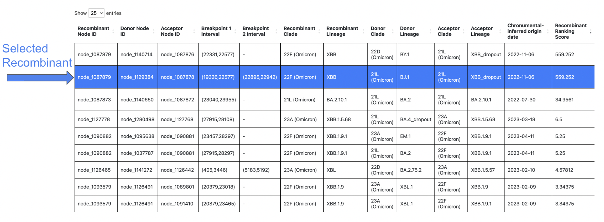

For detailed information on each column of the results table, please see the [RIVET Results Table](https://turakhialab.github.io/rivet/start/table.html) page.

### Sort by Column

## Search Table

## Search by Sample ID

## SNV plot

## Query Descendants
For a selected recombinant ancestor node of interest, you might want to query which samples are descendants of this inferred recombinant. Simply **click** the `Recombinant` label to the left of the track to view up to 10,000 sample descendants of that particular recombinant, as seen in the screenshots below.

You can also click the `Donor` and `Acceptor` labels to query the samples that are descendants of those particular parental nodes.

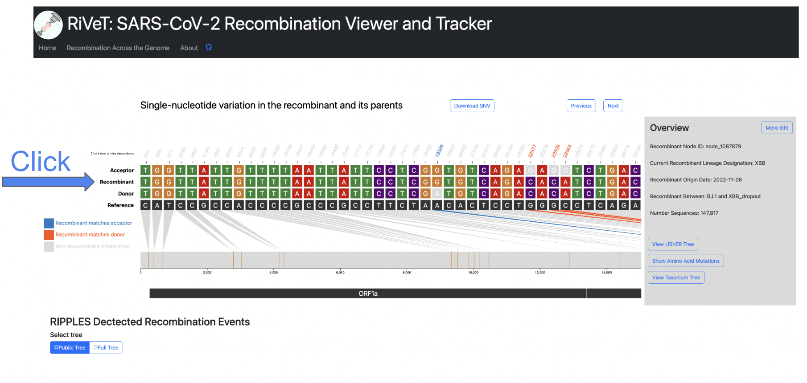

 

The side panel will display the 10,000 sample descendants by default, and you can **click** the `Download Descendants` button to download a `.txt` file containing all sample descendants for the selected trio node. (one per line)

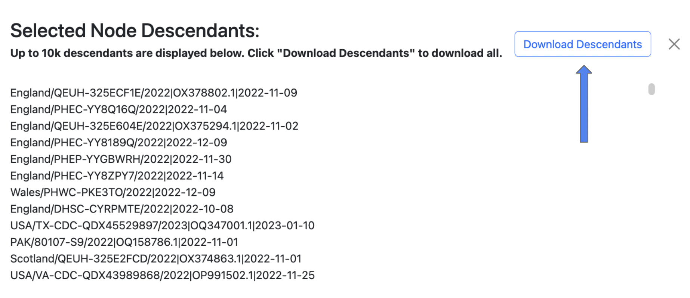

 

## Taxonium View
View trio sequences (recombinant/donor/acceptor) in Taxonium/Treenome Global Phylogeny.
!!! note

    The Taxonium view feature is currently only available for public tree results.
 

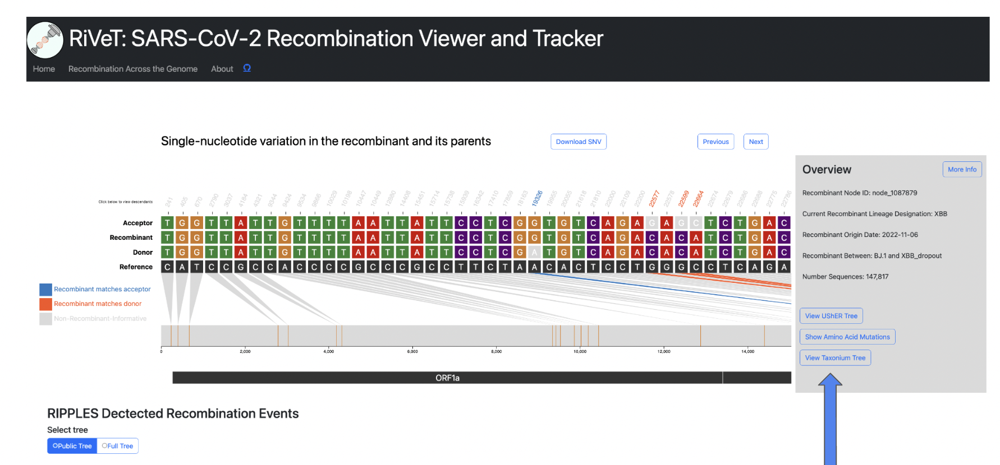

 

The `Recombinant/Donor/Acceptor` nodes are circled in the global tree. Click the magnify button shown in the image below to zoom into the particular node of interest.

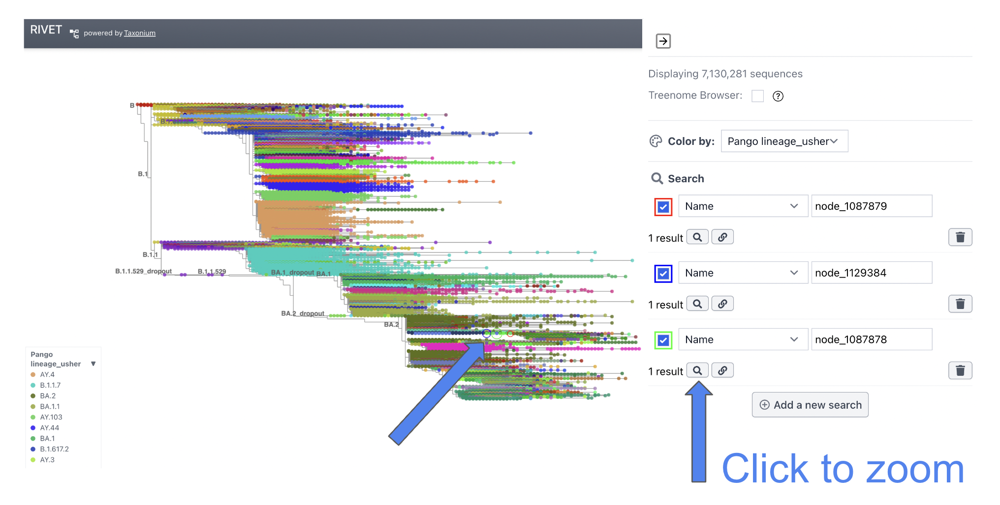
 

## View UShER Subtree
This feature will take you to the [UCSC UShER](https://genome.ucsc.edu/cgi-bin/hgPhyloPlace) tool, where you can view the tree using [UShER](https://github.com/yatisht/usher). This feature will automatically sample 10 descendants from the recombinant node in order to view the subtree.

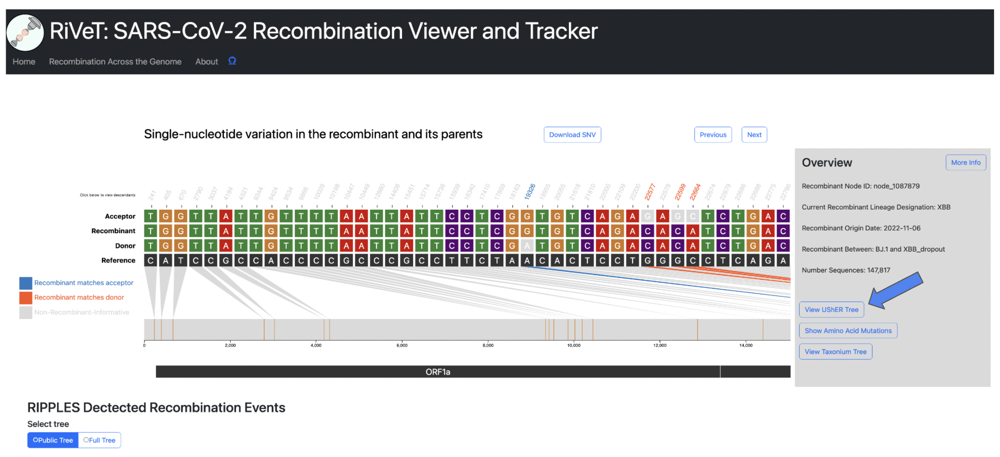

!!! warning

    This feature will open a new tab to `UShER` and may take a few minutes to load in the new tab.

Once finished loading, you will see the following page, where you can view the subtree by clicking `view downsampled global tree in Nextstrain`. 

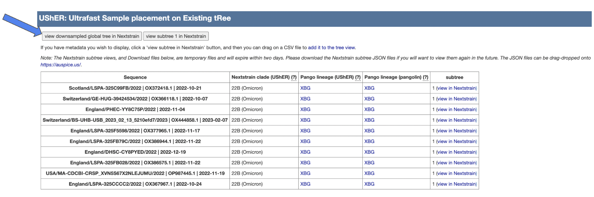

 

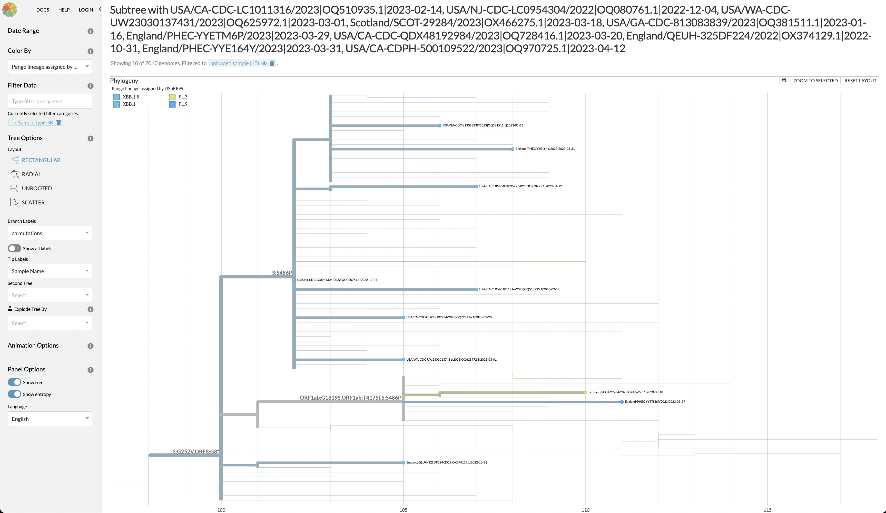

 

## Recombinant Detailed Overview
To view more even more detailed information about a particular recombinant of interest click the `More Info` button in the `Overview` section.

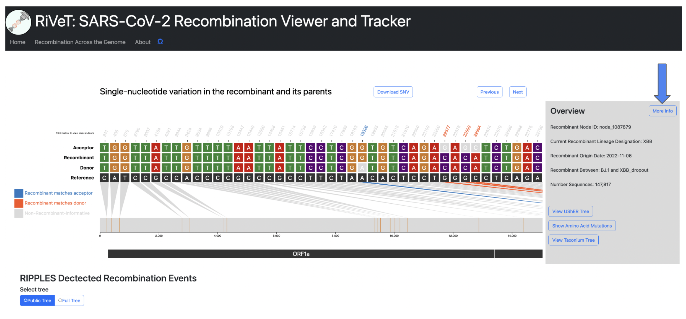
 

**This will display the following information:**

* Current Recombinant Lineage
* Recombinant Origin Date (as inferred by [Chronumental](https://doi.org/10.1101/2021.10.27.465994))
* Recombinant parental lineages
* Number of sequences descendant from this recombinant
* Earliest descendant sequence
* Most recent descendant sequence
* Countries where descendant sequences have been detected
* Quality Control Checks not passing (otherwise PASS if all QC checks pass)

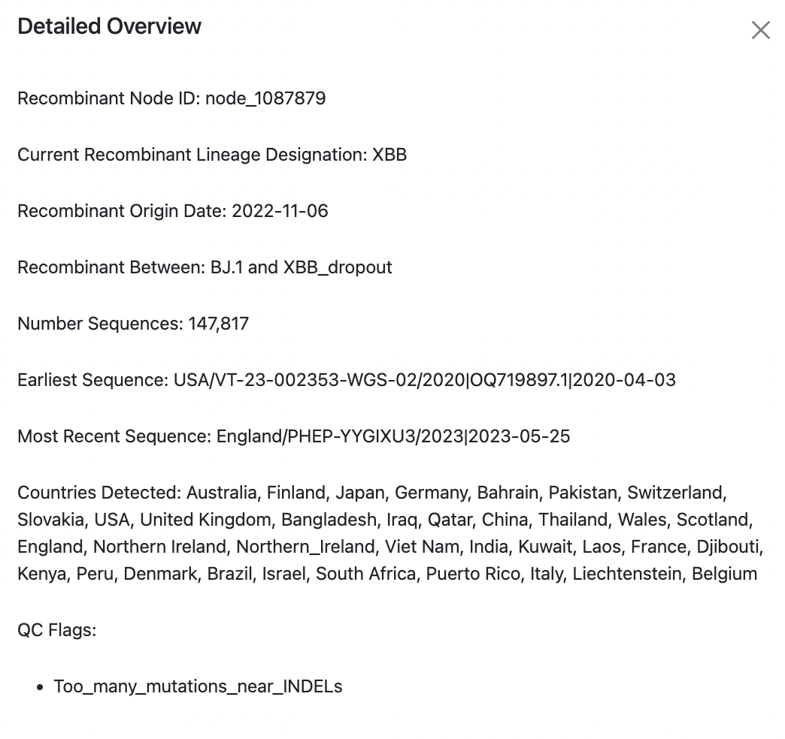

!!! question

    If there is additional information you would like to know for a particular recombinant of interest, please make this suggestion through a [GitHub Issue](https://github.com/TurakhiaLab/rivet/issues) in our repository.

 

## View Amino Acid Sites
This option shows the amino acid mutations matched with their corresponding nucleotide mutation positions. This feature uses `matUtils summary --translate`, which is built automatically into the `RIVET` backend pipeline. In short, `matUtils` provides a method to compute the correct amino acid translations at each node in the tree, which `RIVET` uses to obtain the amino acid mutations for a given recombinant ancestor node.

For more information on this method, please see the following [matUtils documentation](https://usher-wiki.readthedocs.io/en/latest/tutorials.html#example-amino-acid-translation-workflow).

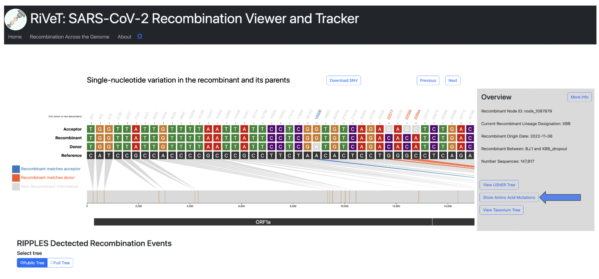

 
All coding amino acid translations are annotated above each corresponding SNV position (if any).

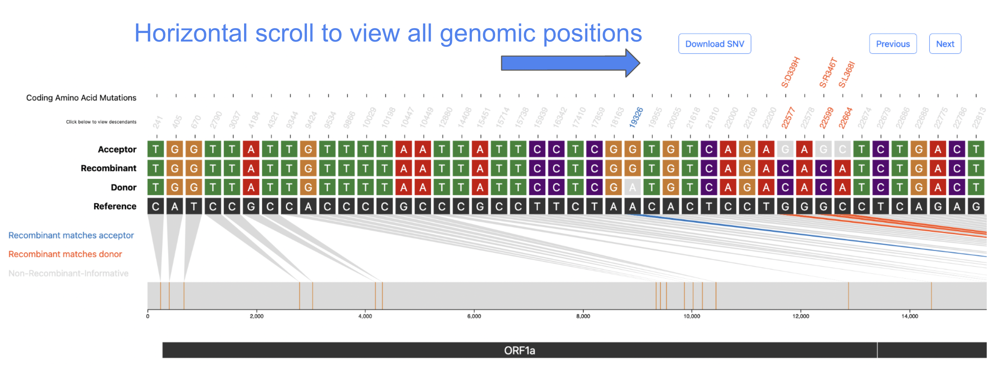
