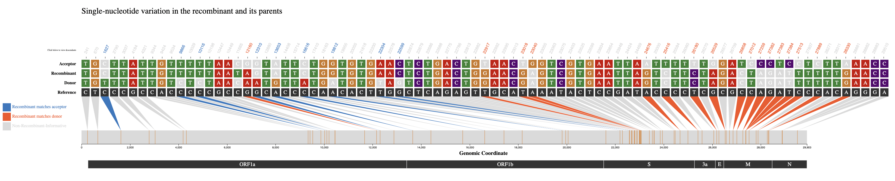

# Web Interface Walkthrough

## Selecting Recombinant of Interest
Each row in the results table represents an inferred recombinant. You can **horizontally scroll** to the right to view more columns in the table, and **click** a row to select the recombinant you are interested in visualizing. 

For detailed information on each column of the results table, please see the [RIVET Results Table](https://turakhialab.github.io/rivet/start/table.html) page.

## Results Table Next and Previous Buttons
Use the `next` and `previous` buttons shown below to skip to the next recombinant result (next row) and SNV visualization in the table.

!!! tip
    You can also use the arrow keys instead of the `next` and `previous` buttons.  Use the right arrow key :arrow_forward: and left arrow key :arrow_backward: to skip to `next` and `previous` results respectively.

## Sort by Column
The results can be sorted by any column, by **clicking on the column title**, shown below:

 

!!! note
    By default, the results are ranked by the `Recombinant Ranking Score`.

## Search Table
The table can be searched and the results shown will be filtered down based on the given query.  For example, if you want to search for all recombinant results with `XBB` lineage classification just type `XBB` into the search bar.

## Search by Sample ID
A user can search for recombinant ancestry in specific samples by using the search by sample identifer feature. Click the toggle button to its active state, and then enter the sample identifier into the search bar.  When the `Search by sample` toggle is active, normal table search will be disabled and all search queries should be sample identifiers.

!!! note
    Once you have entered the sample identifier into the search bar, it may take a few seconds for the table results to refresh with the results of your query.

## SNV plot
When a user clicks on a row to select a recombinant of interest the following visualization, shown below, will be rendered.

The above visualization shows all of the single-nucleotide variant (SNV) sites in the recombinant sequence and its two parents (donor/acceptor), with respect to the reference sequence. The recombinant-informative sites are highlighted in orange where the recombinant matches the donor, and blue where the recombinant matches the acceptor.  The gene region annotations are shown below the trio sequences in the bottom track.

## Query Descendants
For a selected recombinant ancestor node of interest, you might want to query which samples are descendants of this inferred recombinant. Simply **click** the `Recombinant` label to the left of the track to view up to 10,000 sample descendants of that particular recombinant, as seen in the screenshots below.

You can also click the `Donor` and `Acceptor` labels to query the samples that are descendants of those particular parental nodes.

 

The side panel will display the 10,000 sample descendants by default, and you can **click** the `Download Descendants` button to download a `.txt` file containing all sample descendants for the selected trio node. (one per line)

 

## Taxonium View
View trio sequences (recombinant/donor/acceptor) in Taxonium/Treenome Global Phylogeny.
!!! note

    The Taxonium view feature is currently only available for public tree results.
 

 

The `Recombinant/Donor/Acceptor` nodes are circled in the global tree. Click the magnify button shown in the image below to zoom into the particular node of interest.

 

## View UShER Subtree
This feature will take you to the [UCSC UShER](https://genome.ucsc.edu/cgi-bin/hgPhyloPlace) tool, where you can view the tree using [UShER](https://github.com/yatisht/usher). This feature will automatically sample 10 descendants from the recombinant node in order to view the subtree.

!!! warning

    This feature will open a new tab to `UShER` and may take a few minutes to load in the new tab.

Once finished loading, you will see the following page, where you can view the subtree by clicking `view downsampled global tree in Nextstrain`. 

 

 

## Recombinant Detailed Overview
To view more even more detailed information about a particular recombinant of interest click the `More Info` button in the `Overview` section.

 

**This will display the following information:**

* Current Recombinant Lineage
* Recombinant Origin Date (as inferred by [Chronumental](https://doi.org/10.1101/2021.10.27.465994))
* Recombinant parental lineages
* Number of sequences descendant from this recombinant
* Earliest descendant sequence
* Most recent descendant sequence
* Countries where descendant sequences have been detected
* Quality Control Checks not passing (otherwise PASS if all QC checks pass)

!!! question

    If there is additional information you would like to know for a particular recombinant of interest, please make this suggestion through a [GitHub Issue](https://github.com/TurakhiaLab/rivet/issues) in our repository.

 

## View Amino Acid Sites
This option shows the amino acid mutations matched with their corresponding nucleotide mutation positions. This feature uses `matUtils summary --translate`, which is built automatically into the `RIVET` backend pipeline. In short, `matUtils` provides a method to compute the correct amino acid translations at each node in the tree, which `RIVET` uses to obtain the amino acid mutations for a given recombinant ancestor node.

For more information on this method, please see the following [matUtils documentation](https://usher-wiki.readthedocs.io/en/latest/tutorials.html#example-amino-acid-translation-workflow).

 
All coding amino acid translations are annotated above each corresponding SNV position (if any).

