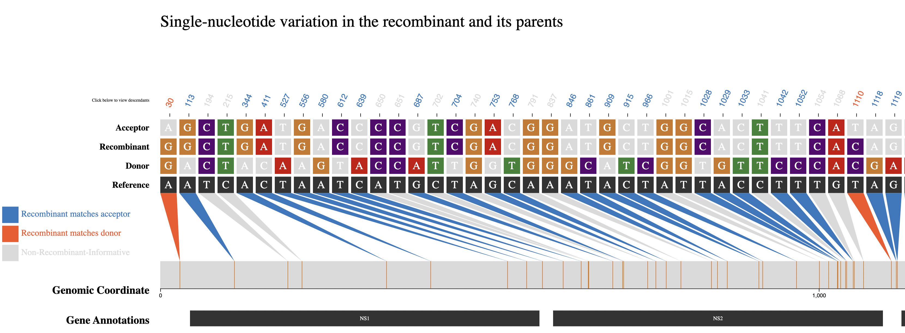
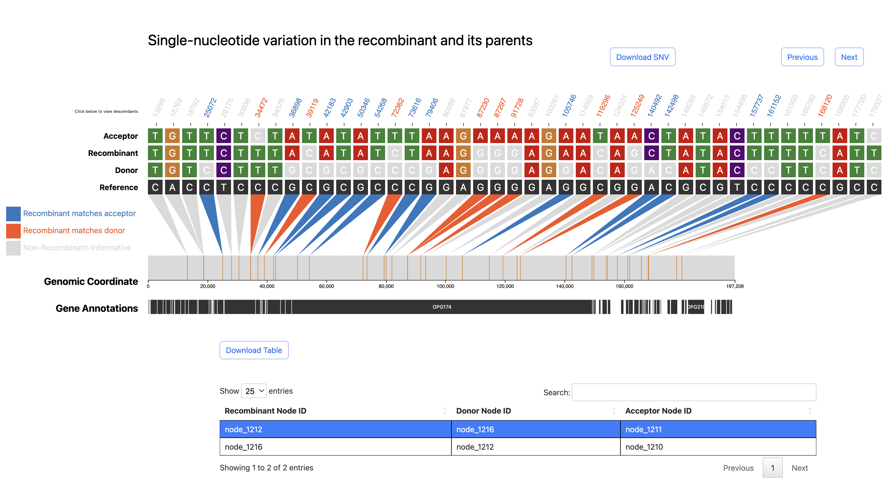

# Using RIVET for Other Pathogens

Below are two examples of using `RIVET's` backend pipeline to infer and visualize recombinants of other pathogens beyond SARS-CoV-2.

!!! warning
    Currently, `RIVET's` backend QC/filtration pipeline is specific to SARS-CoV-2 and will not run when using the `RIVET` backend for other pathogens.


## Human Respiratory Syncytial Virus (HRSV) Subgroup A

Below are the steps followed to infer putative recombinants in an `RSV` mutation-annotated tree (MAT).


### Using RIVET frontend for Visualization





Since the SNV plot for RSV includes many sites, only the region up to around position 1000 is shown in the image above.  
**Please click the download button below to view the entire `RSV` SNV plot as an SVG image.**

<div>
<a href="images/rsv-snv.svg" download>
  <button class="btn" type="button">Download Full RSV SNV Plot</button>
</a>
</div>

<style>
/* Style for download button */
.btn {
  background-color: DodgerBlue;
  border: none;
  color: white;
  padding: 12px 30px;
  cursor: pointer;
  font-size: 20px;
}

.btn:hover {
  background-color: RoyalBlue;
}
</style>

<hr>


## Monkeypox Virus

Edit the following fields in the `config.yaml` file:

Change the GenBank file from the default SARS-CoV-2 file to the corresponding GenBank file for your pathogen of interest, Monkeypox virus in this case.

```yaml
# Pathogen Ref Seq GenBank file
ref_seq: monkeypox.gb
```

!!! Warning
    Make sure the `environment` field is set to `local`.

```yaml
environment: local
port: 2000
```
If desired, you can change the local `port` at which `RIVET` will host the local HTTP server in your browser.

Now run the following command and RIVET will automatically open your browser to launch the frontend results table and SNV visualization.
```
python3 rivet-frontend.py -r recombination_mpxv.2023-07-01.tsv -v mpxv.2023-07-01.vcf -c config.yaml
```

Below is the SNV plot we get for one of the monkeypox virus inferred recombinants.

